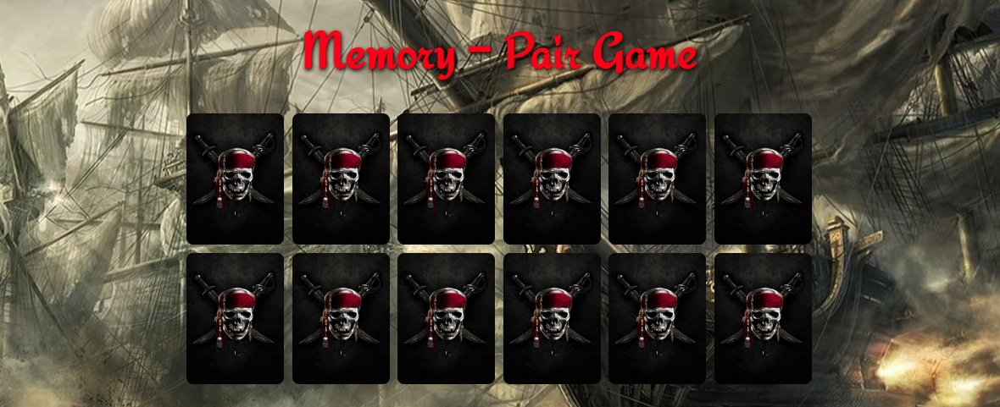

  

<h1 align="center">
  Memory-Pair Game
</h1>

  
  
  

  <a href="https://ik-web.github.io/memory-pair-game/">[> DEMO LINK <]</a> 

## Description:

*Practical work on the Kottans front-end course*

**Memory-Pair Game** - a card game in which all of the cards are laid face down on a surface and two cards are flipped face up over each turn. 
The object of the game is to turn over pairs of matching cards. The game ends when the last pair has been picked up.

## Developers

- [Ihor Kuchin](https://github.com/ik-web)

## License

>MIT License
>
>Copyright (c) 2022 Ihor Kuchin
>
>Permission is hereby granted, free of charge, to any person obtaining a copy
>of this software and associated documentation files (the "Software"), to deal
>in the Software without restriction, including without limitation the rights
>to use, copy, modify, merge, publish, distribute, sublicense, and/or sell
>copies of the Software, and to permit persons to whom the Software is
>furnished to do so, subject to the following conditions:
>
>The above copyright notice and this permission notice shall be included in all
>copies or substantial portions of the Software.
